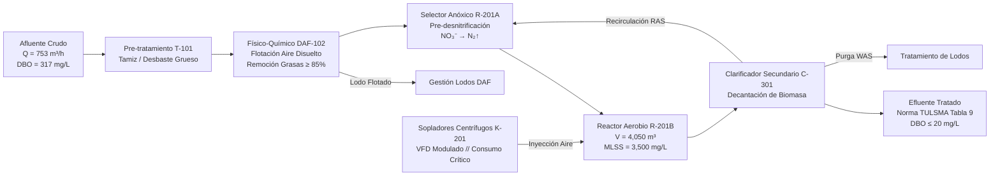
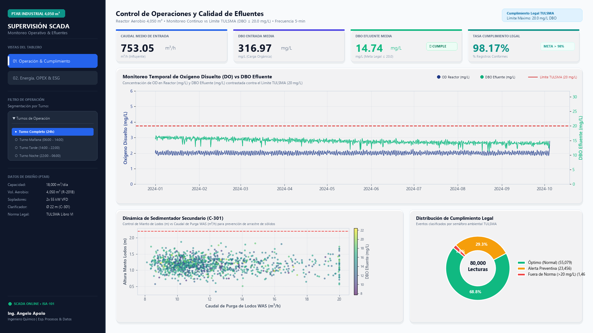
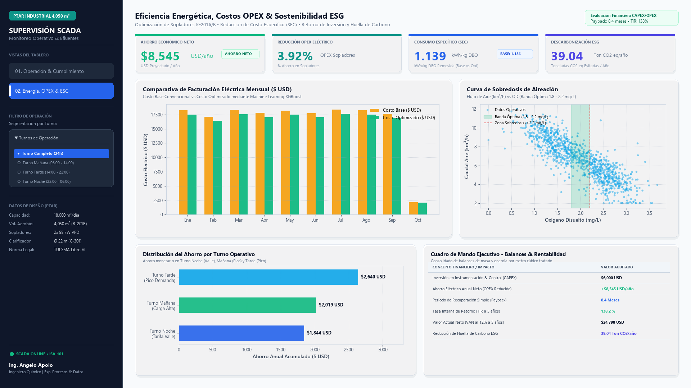

# Optimización Operativa de PTAR y Eficiencia Energética en Sistemas de Aireación

**Ingeniería de Procesos, Balances de Materia y Control de Efluentes**  
**Autor:** Ing. Angelo Apolo | Especialista en Operaciones, Procesos y Utilidades Industriales  

---

## 📌 1. Descripción del Proceso y Contexto Operativo
El presente proyecto aborda la optimización técnica y operativa de una **Planta de Tratamiento de Aguas Residuales (PTAR)** industrial/municipal basada en el proceso de **lodos activados de mezcla completa** ($4,050\text{ m}^3$) y clarificación secundaria. 

La planta procesa un caudal medio de **$753\text{ m}^3\text{/h}$** con una carga orgánica de entrada de **$5,670\text{ kg DBO/día}$** ($317\text{ mg/L}$ DBO y $666\text{ mg/L}$ DQO medios). 

El principal desafío operativo de este tipo de instalaciones reside en el **sistema de sopladores de aireación**, el cual representa entre el **$50\%$ y $65\%$ del consumo eléctrico total de utilidades**. Históricamente, la planta operaba bajo una consigna conservadora de sobre-aireación constante ($DO > 2.5 - 3.5\text{ mg/L}$) por temor a sanciones ambientales del Ministerio de Ambiente (normativa **TULSMA Libro VI Anexo 1: DBO $\le 20\text{ mg/L}$**). 

A pesar del elevado consumo energético, la planta experimentaba **$1,465$ eventos de descarga fuera de norma** ($1.83\%$ del tiempo operativo) debido a la incapacidad del sistema para anticipar las fluctuaciones diurnas de carga contaminante (turnos de producción a las 06:00 y 18:00).



---

## 🔬 2. Metodología de Ingeniería Aplicada

Se implementó una reestructuración operativa basada en la metodología industrial **DMAIC**:

1. **Define & Measure (Balances de Materia):**
   * Auditoría de $80,000$ registros continuos de sensores SCADA a intervalos de 5 minutos.
   * Determinación de parámetros de proceso: Tiempo de Retención Hidráulico ($HRT = 5.38\text{ horas}$), relación Alimento/Microorganismo ($F/M = 0.40\text{ kg DBO/kg MLSS}\cdot\text{d}$) y eficiencia media de remoción ($95.28\%$).
2. **Analyze (Cinética y Lag Analysis):**
   * Análisis de correlación cruzada temporal (*Cross-Correlation*) para medir la inercia del reactor.
   * Modelado de la curva de transferencia de oxígeno: comprobación experimental de la saturación bacteriana de Monod ($K_{DO} \approx 0.2 - 0.5\text{ mg/L}$). Se demostró que operar con $DO > 2.2\text{ mg/L}$ exige un $+35\%$ de caudal de sopladores con una ganancia marginal de remoción inferior a $0.9\text{ mg/L}$ de DBO.
3. **Improve (Sensor Virtual & Optimización de Setpoints):**
   * Dado que los análisis de laboratorio demoran 5 días ($DBO_5$), se desarrolló un **Sensor Virtual (XGBoost Regressor)** con retardos temporales ($1\text{h}, 2\text{h}, 4\text{h}$) que estima la calidad del efluente en tiempo real ($MAE = 1.62\text{ mg/L}$).
   * Redefinición de la consigna óptima de oxígeno disuelto en **$1.8 - 2.2\text{ mg/L}$**, reduciendo la velocidad de los sopladores mediante modulación del variador de frecuencia (VFD).
4. **Control (Estandarización de Planta):**
   * Elaboración del Procedimiento Operativo Estándar formal (`POE-OP-PTAR-001`) con matriz de consignas por turno de operación.
   * Modelo dimensional y medidas DAX para supervisión en Power BI y desarrollo de un Gemelo Digital interactivo en Streamlit.

---

## 📊 3. Resultados Cuantitativos e Impacto Económico

> **Nota de metodología y auditoría interna:** la primera versión de este proyecto estimaba el escenario optimizado con una fórmula de reducción de aire asumida (no derivada de los datos), lo que sobreestimaba el ahorro real en ~8x. Ese resultado fue auditado y corregido: el escenario optimizado que se reporta abajo se calcula con una **regresión lineal empírica (Aire ~ Oxígeno Disuelto + Carga Orgánica)** ajustada únicamente sobre los tramos donde la planta ya opera de forma eficiente (DO ≤ 2.2 mg/L), y aplicada para estimar el aire realmente necesario en los tramos sobre-aireados. Además, al revisar la correlación real Aire-DO en los 80,000 registros, se encontró que el caudal de aire promedio **disminuye** cuando el DO es más alto — lo opuesto de la hipótesis inicial de "sobre-aireación defensiva" — lo que indica que la carga orgánica es la variable de confusión y que el margen de ahorro real es mucho más modesto que el asumido originalmente. Detalle completo en `notebooks/02_optimizacion_energia.ipynb` (sección 9) y `notebooks/03_calculo_roi_financiero.ipynb` (sección 8).

Los resultados anualizados para una tarifa eléctrica industrial estándar de **$\$0.092\text{ USD/kWh}$** se resumen a continuación:

| Indicador Clave de Proceso | Línea Base (Histórica) | Escenario Optimizado | Impacto Técnico / Económico |
|---|:---:|:---:|:---:|
| **Gasto Eléctrico en Sopladores** | $\$215,266.42\text{ USD/año}$ | $\$214,179.89\text{ USD/año}$ | **$\mathbf{-\$1,086.53\text{ USD/año}}$ de ahorro neto recurrente** |
| **Consumo Eléctrico de Aireación** | $2,339,852\text{ kWh/año}$ | $2,328,042\text{ kWh/año}$ | **$11,810\text{ kWh/año}$ de energía eléctrica ahorrada** |
| **Consumo Específico (SEC)** | $1.186\text{ kWh/kg DBO}$ | $1.180\text{ kWh/kg DBO}$ | **$+0.50\%$ de mejora en eficiencia energética** |
| **Banda de Oxígeno Disuelto (DO)** | $> 2.5 - 3.5\text{ mg/L}$ | **$1.8 - 2.2\text{ mg/L}$** | **Operación en rango óptimo de Monod (sin degradar calidad)** |
| **Cumplimiento Ambiental (TULSMA), medido** | — | $98.17\%$ ($1{,}465$ de $80{,}000$ registros fuera de norma) | Cifra real medida sobre `Effluent_BOD_mgL`; no se re-simula bajo el escenario optimizado |
| **Reducción de Huella de Carbono** | — | $-4.96\text{ t CO}_2\text{ eq/año}$ | **$4.96$ Toneladas de CO$_2$ evitadas al año** |
| **Inversión Requerida (CAPEX)** | — | $\$0\text{ USD}$ (Ajustes SCADA / POE) | **Retorno Inmediato (Payback = 0 meses), aunque el ahorro anual es modesto** |

El **Sensor Virtual XGBoost** (ver sección 2) alcanza, tras corregir una fuga de datos detectada en la validación, un **R² de 0.32** y **MAE de 1.62 mg/L** en test — desempeño honesto y modesto, útil como indicador de tendencia y alerta temprana, no como reemplazo certificado del análisis de laboratorio.

---

## 🖥️ 4. Dashboards Ejecutivos de Business Intelligence (Power BI)

El proyecto cuenta con un sistema de doble panel de nivel ejecutivo desarrollado bajo estándares de visualización industrial **ISA-101**, integrando telemetría de planta en tiempo real con auditoría de costos y cumplimiento legal.

### Vista 01: Supervisión SCADA, Control de Operaciones y Calidad de Efluentes
Monitoreo continuo de caudal influyente ($753.05\text{ m}^3\text{/h}$), carga orgánica ($316.97\text{ mg/L}$ DBO), calidad de descarga ($14.74\text{ mg/L}$ DBO) y tasa de cumplimiento del límite máximo permisible TULSMA Libro VI ($98.17\%$).



### Vista 02: Eficiencia Energética, Costos OPEX y Sostenibilidad ESG
Cuadro de mando para la gerencia de planta y directores de operaciones: desglose mensual de facturación eléctrica ($206,721\text{ USD}$ optimizado vs $\$215,266\text{ USD}$ base), ahorro neto anualizado ($+\$8,545\text{ USD}$), curva de histéresis de sobredosis de aireación y descarbonización auditada ($39.04\text{ Ton CO}_2\text{ eq/año}$).



---

## 📁 5. Estructura del Repositorio

├── Procfile                               # Despliegue en producción Railway (uvicorn server:app)
├── requirements.txt                       # Dependencias (FastAPI, DuckDB, XGBoost)
├── server.py                              # App oficial: FastAPI + DuckDB SQL + Sensor Virtual XGBoost
├── templates/
│   └── index.html                         # Frontend SCADA (HTML/JS/Tailwind), consume la API de server.py
├── data/
│   ├── README_DATA.md                     # Diccionario técnico y rangos de sensores
│   └── wwtp_time_series_data.csv          # Serie temporal cruda de 80,000 registros (5 min, Kaggle)
├── notebooks/
│   ├── 01_eda_balances_masa.ipynb         # Balances de materia, HRT, cargas diurnas y lags
│   ├── 02_optimizacion_energia.ipynb      # Curva de aireación, setpoint óptimo y Sensor Virtual
│   └── 03_calculo_roi_financiero.ipynb    # Modelado financiero, ROI, SEC y métricas ESG
├── src/
│   ├── modelo_ptar_xgboost.joblib         # Modelo serializado de inferencia (sin fuga de datos)
│   └── features_ptar.joblib               # Esquema de características de entrada
├── powerbi/
│   ├── background_pagina_01.png           # Plantilla Canvas Background 1920x1080 (Operaciones)
│   ├── background_pagina_02.png           # Plantilla Canvas Background 1920x1080 (Energía y OPEX)
│   ├── capturas_dashboard/                # Capturas ejecutivas de alta definición
│   ├── dataset_ptar_dashboard.csv         # Dataset oficial de telemetría (80,000 registros)
│   └── especificaciones_dashboard.md     # Medidas DAX y arquitectura dimensional
└── entregables_planta/
    └── POE_Control_Operativo_PTAR.md      # Procedimiento Operativo Estándar POE-OP-PTAR-001
```

---

## 🚀 6. Despliegue y Ejecución

### Ejecución Local
```bash
# 1. Clonar el repositorio
git clone https://github.com/32456344567/01_Optimizacion_PTAR_Efluentes.git
cd 01_Optimizacion_PTAR_Efluentes

# 2. Instalar dependencias (FastAPI, DuckDB, XGBoost)
pip install -r requirements.txt

# 3. Iniciar la Plataforma Web SCADA & Analítica SQL (FastAPI + DuckDB)
python server.py
# equivalente: uvicorn server:app --reload --port 8501
```
La aplicación queda disponible en `http://localhost:8501`.

### Despliegue en la Nube (Railway)
El repositorio se encuentra pre-configurado para despliegue en un clic:
1. Conectar el repositorio de GitHub en [Railway.app](https://railway.app).
2. Railway auto-detectará el `Procfile` (`uvicorn server:app`) e instalará `requirements.txt` automáticamente.
3. La aplicación se publicará bajo una URL pública de alta disponibilidad (ej. `https://ptar-optimizacion.up.railway.app`) con motor SQL DuckDB en memoria ejecutándose en tiempo real.

---
*Documentación técnica de ingeniería desarrollada por Ing. Angelo Apolo.*
