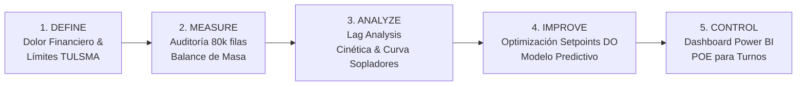

# MASTER BLUEPRINT: Optimización Operativa de PTAR, Eficiencia Energética y Cumplimiento de Efluentes
**Proyecto 01 | Portafolio Técnico de Operaciones y Procesos Industriales**  
**Candidato:** Angelo Apolo | Ing. Químico / Industrial | Máster en Dirección de Proyectos y Empresas  
**Target Profesional:** Ingeniero de Procesos, Jefe de Operaciones / Planta, Supervisor de Utilidades, Coordinador de Calidad y Medio Ambiente  

---

## 🎯 1. Objetivo Estratégico y Propuesta de Valor
Demostrar a Directores de Operaciones y Gerentes de Planta que el candidato no es un "analista de escritorio", sino un **ingeniero de procesos con experiencia real de planta** capaz de:
1. Dominar la fisicoquímica y dinámica biológica de un sistema de lodos activados y sedimentación secundaria (PTAR).
2. Optimizar el consumo de energía eléctrica de sopladores (el mayor centro de costo en utilidades de tratamiento) sin poner en riesgo la degradación biológica.
3. Garantizar un **100% de cumplimiento ambiental** en la descarga de efluentes (DBO de salida bajo normativas como TULSMA), evitando multas, contingencias legales o clausuras de fábrica.
4. Diseñar herramientas operativas tangibles: tableros en Power BI para supervisión y Procedimientos Operativos Estándar (POEs) para el personal de turno.

---

## 🛠️ 2. Stack Tecnológico y Justificación
* **Python (Data Processing, EDA & Modelado):**
  * `pandas`, `numpy`: Tratamiento y resampleo de series de tiempo (80,000 registros), cálculo de variables derivadas (edad de lodos SRT, carga volumétrica, remoción de DBO/DQO).
  * `scipy.stats`, `statsmodels`: Análisis de autocorrelación, correlación cruzada (lag analysis para el tiempo de residencia hidráulico y biológico).
  * `scikit-learn` / `xgboost`: Modelo predictivo de `Effluent_BOD_mgL` para anticipación de desvíos operacionales y optimización multivariable de flujo de aire vs. oxígeno disuelto.
* **Power BI (Visualización Ejecutiva y de Planta):**
  * Dashboard de control de PTAR con vista de Operación (monitoreo en tiempo real de DBO, DQO, DO, caudal) y vista de Costos/Sostenibilidad (kWh consumidos en aireación vs. carga removida).
* **Excel / Documentación Técnica:**
  * Procedimiento Operativo Estándar (POE) con matriz de consignas (*setpoints*) para operadores de turno según la carga de entrada.

---

## 🔬 3. Marco Metodológico: DMAIC Industrial



### Fase 1: DEFINE (Definición del Problema de Negocio)
* **El Problema:** La PTAR opera con sopladores sobredimensionados/continuos por miedo a descargas fuera de norma. Consumo excesivo de energía eléctrica y falta de predictibilidad ante picos de carga.
* **Métrica Primaria:** Costo energético de aireación ($\text{kWh} / \text{kg DBO removida}$).
* **Métrica Secundaria (Restricción de Cumplimiento):** $\text{Effluent\_BOD\_mgL} \le 20 \text{ mg/L}$ (estándar ambiental).

### Fase 2: MEASURE (Medición y Balance de Masa)
* Fuente de datos: `data/wwtp_time_series_data.csv` (80,000 filas).
* Variables base: `Influent_Flow_m3h`, `Influent_BOD_mgL`, `Influent_COD_mgL`, `Aeration_Tank_DO_mgL`, `Air_Flow_km3h`, `RAS_Flow_m3h`, `WAS_Flow_m3h`, `Effluent_BOD_mgL`.
* Cálculos de balance:
  * Carga orgánica másica diaria: $L_{BOD} = Q_{in} \times BOD_{in} \times 24 / 1000 \text{ [kg/día]}$.
  * Tasa de remoción de contaminantes: $\eta_{BOD} = (BOD_{in} - BOD_{out}) / BOD_{in} \times 100\%$.
  * Relación Alimento/Microorganismo ($F/M$) y edad del lodo ($\theta_c$ o SRT).

### Fase 3: ANALYZE (Análisis Causa-Efecto y Cinética)
* **Lag Analysis (Tiempo de Residencia Hidráulico - HRT):** Demostrar la correlación temporal entre una perturbación en la entrada y su impacto en la salida horas después.
* **Curva de Rendimiento de Aireación:** Graficar `Air_Flow_km3h` vs. `Aeration_Tank_DO_mgL` vs. remoción de DBO. Identificar el "punto de rendimiento decreciente" donde inyectar más aire no reduce más DBO y solo desperdicia electricidad.
* **Impacto de la Purga (WAS):** Analizar cómo variaciones en `WAS_Flow_m3h` desestabilizan el manto de lodos en el sedimentador secundario (`Clarifier_Blanket_Height_m`).

### Fase 4: IMPROVE (Mejora y Optimización)
* **Curva de Consignas Óptimas de DO:** Establecer la banda de control óptima de oxígeno disuelto ($1.8 - 2.2 \text{ mg/L}$) en lugar de operar a $>3.5 \text{ mg/L}$.
* **Modelo Predictivo de Alerta Temprana:** Entrenar un modelo ligero (Random Forest / XGBoost) que prediga la DBO de salida con 4 a 6 horas de anticipación a partir de los sensores del tanque biológico y carga de entrada.
* **Cuantificación Financiera del Ahorro:** Calcular el ahorro anual en dólares asumiendo una tarifa industrial estándar ($0.092 \text{ USD/kWh}$).

### Fase 5: CONTROL (Garantía de Sostenibilidad)
* **Tablero Power BI:** Vista ejecutiva con alertas por semáforo cuando el modelo predictivo detecte riesgo de excedencia en el efluente.
* **Procedimiento Operativo Estándar (POE / SOP):** Guía de 1 página para el operador de turno: qué perilla mover ante variaciones de caudal o turbidez.

---

## 📁 4. Estructura de Entregables del Proyecto
Para que este proyecto destaque en tu portafolio de Notion y GitHub, debe generar estos archivos:

```text
01_Optimizacion_PTAR_Efluentes/
├── README.md                      <-- Este Blueprint maestro
├── data/
│   ├── README_DATA.md             <-- Ficha técnica oficial del dataset
│   └── wwtp_time_series_data.csv  <-- Dataset de 80k registros (ya descargado)
├── notebooks/
│   ├── 01_eda_balances_masa.ipynb <-- Limpieza, series de tiempo y balances de ingeniería
│   ├── 02_optimizacion_energia.ipynb <-- Curvas de aireación, DO y modelo predictivo
│   └── 03_calculo_roi_financiero.ipynb <-- Cuantificación de ahorro energético ($)
├── powerbi/
│   ├── dashboard_ptar_operaciones.pbix <-- Tablero interactivo de planta
│   └── capturas_dashboard/        <-- Imágenes para Notion
└── entregables_planta/
    ├── POE_Control_Operativo_PTAR.pdf <-- Procedimiento formal de piso
    └── Executive_Case_Study_PTAR.md   <-- Resumen ejecutivo estilo STAR/CAR
```

---

## 💡 5. Prompt Maestro para Comenzar el Proyecto en un Nuevo Chat

Copia y pega este prompt exacto al abrir el nuevo chat dedicado a este proyecto:

```markdown
Hola. Vamos a desarrollar el **Proyecto 01: Optimización Operativa de PTAR, Eficiencia Energética y Cumplimiento de Efluentes**, el cual forma parte de mi portafolio técnico para cargos de Jefe de Operaciones / Planta, Ingeniero de Procesos y Coordinador de Calidad/HSE.

Revisa el archivo maestro del proyecto ubicado en:
`c:\Users\apolo\Mi unidad\Estrategias para conseguir un mejor empleo\proyectos_portafolio\01_Optimizacion_PTAR_Efluentes\README.md`
Y la ficha de datos en:
`c:\Users\apolo\Mi unidad\Estrategias para conseguir un mejor empleo\proyectos_portafolio\01_Optimizacion_PTAR_Efluentes\data\README_DATA.md`

El dataset ya está descargado en:
`c:\Users\apolo\Mi unidad\Estrategias para conseguir un mejor empleo\proyectos_portafolio\01_Optimizacion_PTAR_Efluentes\data\wwtp_time_series_data.csv` (80,000 registros).

REGLAS DE TRABAJO:
1. No hagas código de juguete ni teóricos académicos abstractos. Enfoque 100% piso de planta industrial y balances de materia reales.
2. Mi perfil real incluye operación de PTAR en Incarpalm (lodos activados, DAF, sopladores, pH, DQO, DBO, normativas TULSMA y SAP PM) y maestría en Dirección de Proyectos.
3. Debemos seguir la metodología DMAIC definida en el Blueprint, generando los notebooks en Python, el análisis de ahorro energético en dólares, las especificaciones del tablero Power BI y el POE de planta.

Comencemos con la Fase 1 y 2: crea la carpeta `notebooks/`, ejecuta el script de análisis exploratorio inicial, balance de masa y verificación de dinámicas diurnas del dataset.
```
