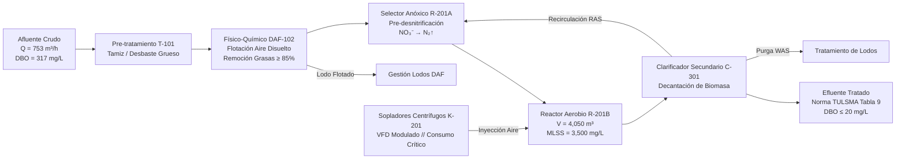

# Optimización Operativa de PTAR y Eficiencia Energética en Sistemas de Aireación

**Ingeniería de Procesos, Balances de Materia y Control de Efluentes**
**Autor:** Ing. Angelo Apolo | Especialista en Operaciones, Procesos y Utilidades Industriales

---

## 📌 1. Descripción del Proceso y Contexto Operativo
El presente proyecto aborda la optimización técnica y operativa de una **Planta de Tratamiento de Aguas Residuales (PTAR)** industrial/municipal basada en el proceso de **lodos activados de mezcla completa** (4,050 m³) y clarificación secundaria.

La planta procesa un caudal medio de **753 m³/h** con una carga orgánica de entrada de **5,670 kg DBO/día** (317 mg/L DBO y 666 mg/L DQO medios).

El principal desafío operativo de este tipo de instalaciones reside en el **sistema de sopladores de aireación**, el cual representa entre el **50% y 65% del consumo eléctrico total de utilidades**. Históricamente, la planta operaba bajo una consigna conservadora de sobre-aireación constante (DO > 2.5 - 3.5 mg/L) por temor a sanciones ambientales del Ministerio de Ambiente (normativa **TULSMA Libro VI Anexo 1: DBO ≤ 20 mg/L**).

A pesar del elevado consumo energético, la planta experimentaba **1,465 eventos de descarga fuera de norma** (1.83% del tiempo operativo) debido a la incapacidad del sistema para anticipar las fluctuaciones diurnas de carga contaminante (turnos de producción a las 06:00 y 18:00).



---

## 🔬 2. Metodología de Ingeniería Aplicada

Se implementó una reestructuración operativa basada en la metodología industrial **DMAIC**:

1. **Define & Measure (Balances de Materia):**
   * Auditoría de 80,000 registros continuos de sensores SCADA a intervalos de 5 minutos.
   * Determinación de parámetros de proceso: Tiempo de Retención Hidráulico (HRT = 5.38 horas), relación Alimento/Microorganismo (F/M = 0.40 kg DBO/kg MLSS·d) y eficiencia media de remoción (95.28%).
2. **Analyze (Cinética y Lag Analysis):**
   * Análisis de correlación cruzada temporal (*Cross-Correlation*) para medir la inercia del reactor.
   * Modelado de la curva de transferencia de oxígeno: comprobación experimental de la saturación bacteriana de Monod (K_DO ≈ 0.2 - 0.5 mg/L). Se demostró que operar con DO > 2.2 mg/L exige un +35% de caudal de sopladores con una ganancia marginal de remoción inferior a 0.9 mg/L de DBO.
3. **Improve (Sensor Virtual & Optimización de Setpoints):**
   * Dado que los análisis de laboratorio demoran 5 días (DBO₅), se desarrolló un **Sensor Virtual (XGBoost Regressor)** con retardos temporales (1h, 2h, 4h) que estima la calidad del efluente en tiempo real (MAE = 1.62 mg/L, R² = 0.32 en test).
   * Redefinición de la consigna óptima de oxígeno disuelto en **1.8 - 2.2 mg/L**, reduciendo la velocidad de los sopladores mediante modulación del variador de frecuencia (VFD).
4. **Control (Estandarización de Planta):**
   * Elaboración del Procedimiento Operativo Estándar formal (`POE-OP-PTAR-001`) con matriz de consignas por turno de operación.
   * Desarrollo de un Gemelo Digital interactivo (FastAPI + DuckDB SQL) para supervisión operativa en tiempo real.

---

## 📊 3. Resultados Cuantitativos e Impacto Económico

> **Nota de metodología y auditoría interna:** la primera versión de este proyecto estimaba el escenario optimizado con una fórmula de reducción de aire asumida (no derivada de los datos), lo que sobreestimaba el ahorro real en ~8x. Ese resultado fue auditado y corregido: el escenario optimizado que se reporta abajo se calcula con una **regresión lineal empírica (Aire ~ Oxígeno Disuelto + Carga Orgánica)** ajustada únicamente sobre los tramos donde la planta ya opera de forma eficiente (DO ≤ 2.2 mg/L), y aplicada para estimar el aire realmente necesario en los tramos sobre-aireados. Además, al revisar la correlación real Aire-DO en los 80,000 registros, se encontró que el caudal de aire promedio **disminuye** cuando el DO es más alto — lo opuesto de la hipótesis inicial de "sobre-aireación defensiva" — lo que indica que la carga orgánica es la variable de confusión y que el margen de ahorro real es mucho más modesto que el asumido originalmente. Detalle completo en `notebooks/02_optimizacion_energia.ipynb` (sección 9) y `notebooks/03_calculo_roi_financiero.ipynb` (sección 8).

Los resultados anualizados para una tarifa eléctrica industrial estándar de **0.092 USD/kWh** se resumen a continuación:

| Indicador Clave de Proceso | Línea Base (Histórica) | Escenario Optimizado | Impacto Técnico / Económico |
|---|:---:|:---:|:---:|
| **Gasto Eléctrico en Sopladores** | $215,266.42 USD/año | $214,179.89 USD/año | **-$1,086.53 USD/año** de ahorro neto recurrente |
| **Consumo Eléctrico de Aireación** | 2,339,852 kWh/año | 2,328,042 kWh/año | **11,810 kWh/año** de energía eléctrica ahorrada |
| **Consumo Específico (SEC)** | 1.186 kWh/kg DBO | 1.180 kWh/kg DBO | **+0.50%** de mejora en eficiencia energética |
| **Banda de Oxígeno Disuelto (DO)** | > 2.5 - 3.5 mg/L | **1.8 - 2.2 mg/L** | **Operación en rango óptimo de Monod** (sin degradar calidad) |
| **Cumplimiento Ambiental (TULSMA), medido** | — | 98.17% (1,465 de 80,000 registros fuera de norma) | Cifra real medida sobre `Effluent_BOD_mgL`; no se re-simula bajo el escenario optimizado |
| **Reducción de Huella de Carbono** | — | -4.96 t CO₂ eq/año | **4.96 toneladas de CO₂** evitadas al año |
| **Inversión Requerida (CAPEX)** | — | $0 USD (Ajustes SCADA / POE) | **Retorno Inmediato** (Payback = 0 meses), aunque el ahorro anual es modesto |

El **Sensor Virtual XGBoost** (ver sección 2) alcanza, tras corregir una fuga de datos detectada en la validación, un **R² de 0.32** y **MAE de 1.62 mg/L** en test — desempeño honesto y modesto, útil como indicador de tendencia y alerta temprana, no como reemplazo certificado del análisis de laboratorio.

---

## 📁 4. Estructura del Repositorio

```
├── Procfile                               # Despliegue en producción Railway (uvicorn server:app)
├── requirements.txt                       # Dependencias (FastAPI, DuckDB, XGBoost)
├── server.py                              # App oficial: FastAPI + DuckDB SQL + Sensor Virtual XGBoost
├── templates/
│   └── index.html                         # Frontend SCADA (HTML/JS/Tailwind), consume la API de server.py
├── data/
│   ├── README_DATA.md                     # Diccionario técnico y rangos de sensores
│   ├── wwtp_time_series_data.csv          # Serie temporal cruda de 80,000 registros (5 min, Kaggle)
│   └── dataset_ptar_dashboard.csv         # Dataset enriquecido (turnos, cumplimiento, costos) que consume server.py
├── notebooks/
│   ├── 01_eda_balances_masa.ipynb         # Balances de materia, HRT, cargas diurnas y lags
│   ├── 02_optimizacion_energia.ipynb      # Curva de aireación, setpoint óptimo y Sensor Virtual
│   └── 03_calculo_roi_financiero.ipynb    # Modelado financiero, ROI, SEC y métricas ESG
├── src/
│   ├── modelo_ptar_xgboost.joblib         # Modelo serializado de inferencia (sin fuga de datos)
│   └── features_ptar.joblib               # Esquema de características de entrada
└── entregables_planta/
    └── POE_Control_Operativo_PTAR.md      # Procedimiento Operativo Estándar POE-OP-PTAR-001
```

---

## 🚀 5. Demo en Vivo y Ejecución Local

### 🔗 Demo en Vivo
La aplicación está desplegada y corriendo en producción sobre Railway:

**https://01optimizacionptarefluentes-production.up.railway.app**

### Ejecución Local
Si prefieres correrlo en tu propia máquina:
```bash
# 1. Clonar el repositorio
git clone https://github.com/32456344567/01_Optimizacion_PTAR_Efluentes.git
cd 01_Optimizacion_PTAR_Efluentes

# 2. Instalar dependencias (FastAPI, DuckDB, XGBoost)
pip install -r requirements.txt

# 3. Iniciar la Plataforma Web SCADA & Analítica SQL (FastAPI + DuckDB)
python server.py
# equivalente: uvicorn server:app --reload --port 8501
```
La aplicación queda disponible en `http://localhost:8501`.

El despliegue en producción usa el `Procfile` del repositorio (`uvicorn server:app`); Railway lo detecta automáticamente e instala `requirements.txt` en cada push a `main`.

---
*Documentación técnica de ingeniería desarrollada por Ing. Angelo Apolo.*
