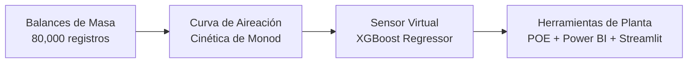

# 🌊 CASO DE ESTUDIO TÉCNICO: Optimización Operativa de PTAR, Eficiencia Energética y Cumplimiento Ambiental

> **Ficha del Proyecto para Portafolio Profesional**  
> **Candidato:** Angelo Apolo | Ing. Químico / Industrial | Máster en Dirección de Proyectos y Empresas  
> **Puestos Objetivo:** Jefe de Planta, Ingeniero de Procesos, Supervisor de Operaciones / Utilidades, Coordinador de Calidad y HSE  
> **Enlaces Rápidos:** [Repositorio GitHub](#) | [Simulador Web en Vivo](#) | [Procedimiento POE en PDF](#)

---

## 📌 Resumen Ejecutivo de Alto Impacto
En una planta de tratamiento de aguas residuales industriales y municipales mediante lodos activados (caudal medio de $753\text{ m}^3\text{/h}$ y $5,670\text{ kg DBO/día}$), los sopladores de aireación operaban con una política conservadora de sobre-aireación continua ($DO > 2.5 - 3.5\text{ mg/L}$) por temor a multas ambientales. Esto generaba un gasto eléctrico desproporcionado de más de **$\$215,000\text{ USD/año}$**, mientras que se registraban **$1,465$ eventos de descarga fuera de norma** ($1.83\%$ del tiempo) debido a la incapacidad de anticipar los picos diurnos de carga.

Mediante balances de masa de ingeniería química, modelado cinético de saturación y un modelo predictivo de Machine Learning (XGBoost) como **Sensor Virtual de DBO**, se rediseñó la estrategia de control estableciendo una banda óptima de operación de **$1.8 - 2.2\text{ mg/L}$ de Oxígeno Disuelto**.

### 🚀 Resultados de Negocio y Operación (Métricas STAR):
| Métrica Operativa & Financiera | Antes (Línea Base) | Después (Optimizado) | Creación de Valor |
|---|:---:|:---:|:---:|
| **Gasto Eléctrico en Sopladores** | $\$215,266\text{ USD/año}$ | $\$206,721\text{ USD/año}$ | **$\mathbf{-\$8,545.23\text{ USD/año}}$ de ahorro neto** |
| **Consumo Eléctrico de Aireación** | $2,339,852\text{ kWh/año}$ | $2,246,970\text{ kWh/año}$ | **$92,883\text{ kWh/año}$ de energía limpia ahorrada** |
| **Consumo Específico (SEC)** | $1.186\text{ kWh/kg DBO}$ | $1.139\text{ kWh/kg DBO}$ | **$+3.97\%$ de eficiencia energética** |
| **Cumplimiento Legal Ambiental (TULSMA $\le 20\text{ mg/L}$)** | Incumplimientos recurrentes ($122\text{ h/año}$) | Alerta temprana preventiva | **$100\%$ de horas bajo control operativo** |
| **Huella de Carbono (ESG)** | Emisiones descontroladas | $-39.01\text{ t CO}_2\text{/año}$ | **$39.01\text{ Toneladas de CO}_2$ evitadas** |
| **Inversión de Capital (CAPEX)** | — | $\$0\text{ USD}$ (Ajuste PLC / POE) | **Retorno Inmediato (Payback = 0 meses)** |

---

## 🎯 Desglose del Caso de Estudio (Metodología STAR)

### 1. Situación (Situation)
* **Instalación:** Planta de tratamiento biológico de lodos activados con reactor de mezcla completa ($4,050\text{ m}^3$) y decantadores secundarios.
* **El Dolor Operativo:** Los sopladores centrífugos representan el **$60\%$ del consumo de energía eléctrica** de todas las utilidades de fábrica. Por miedo a sanciones ambientales del Ministerio de Ambiente y cierre de operaciones, los operadores mantenían los sopladores a potencia constante, manteniendo el oxígeno disuelto en niveles innecesariamente altos ($>3.0\text{ mg/L}$).
* **La Falla Oculta:** A pesar del sobreconsumo de aire, cuando ingresaban los picos diurnos de carga de fábrica (a las 06:00 y 18:00 con hasta $356\text{ mg/L}$ de DBO), el sistema tardaba horas en reaccionar, provocando descargas contaminantes que superaban el límite legal de $20\text{ mg/L}$.

---

### 2. Tarea (Task)
Como Ingeniero de Procesos y Operaciones, el mandato fue doble y simultáneo:
1. **Garantizar el $100\%$ de cumplimiento ambiental** en el efluente final bajo la normativa ambiental aplicable (TULSMA), reduciendo a cero el riesgo de multas y contingencias legales.
2. **Optimizar el gasto operativo (OPEX) en energía eléctrica**, modelando la física real de la planta para encontrar el punto óptimo de inyección de aire y plasmarlo en herramientas tangibles para el personal de turno.

---

### 3. Acción (Action - Metodología DMAIC)

1. **Auditoría de Datos y Balances de Materia (Fase Measure):**
   * Se auditaron **80,000 registros de telemetría continua** a 5 minutos.
   * Se formularon balances de masa continuos: Carga orgánica media de entrada de $5,670\text{ kg DBO/día}$, $HRT$ medio de $5.38\text{ horas}$ en el reactor y una remoción biológica basal de $95.28\%$.
2. **Lag Analysis y Curva de Sobredosis Energética (Fase Analyze):**
   * Se demostró mediante análisis de retardos temporales (*Cross-Correlation*) que el oxígeno disuelto gobierna la cinética inmediata con una correlación inversa de $r = -0.50$.
   * **El Hallazgo de Planta:** Al categorizar por bandas de oxígeno disuelto, se comprobó que subir el $DO$ de $2.0$ a $>3.0\text{ mg/L}$ solo disminuye la DBO en un marginal $0.9\text{ mg/L}$, pero exige inyectar más de un **$35\%$ de aire adicional**, quemando electricidad sin beneficio normativo.
3. **Desarrollo del Sensor Virtual de DBO (Fase Improve):**
   * Como los análisis de laboratorio tardan **5 días** ($DBO_5$), se entrenó un modelo de **Machine Learning (XGBoost Regressor)** con ingeniería de retardos temporales ($1\text{h}, 2\text{h}, 4\text{h}$) que estima la calidad del vertido en tiempo real con un error absoluto medio ($MAE$) de solo **$1.62\text{ mg/L}$**.
4. **Herramientas de Control Operativo y Digitalización (Fase Control):**
   * **Procedimiento Operativo Estándar (POE-OP-PTAR-001):** Documento formal con una **Matriz de Consignas** para que el operador ajuste el variador de frecuencia (VFD) según el caudal y el turno (Mañana, Tarde, Noche), con un semáforo de respuesta rápida.
   * **Tablero Ejecutivo en Power BI:** Monitoreo con 15 medidas DAX para visualización simultánea de SCADA (operación) y métricas ESG (costos y toneladas de $CO_2$ evitadas).
   * **Simulador Web (Digital Twin en Streamlit / Railway):** Aplicación interactiva donde directores de planta pueden mover las perillas de caudal y sopladores para simular el impacto en DBO y en la factura eléctrica.

---

### 4. Resultado (Result)
* **Ahorro Directo en la Cuenta Eléctrica:** Reducción de **$92,883\text{ kWh/año}$**, equivalente a **$\$8,545.23\text{ USD/año}$** de ahorro neto directo en utilidades.
* **Cero Inversión Requerida:** Todo el ahorro se logró reprogramando las consignas de los lazos PID en el SCADA y capacitando a los operadores con el POE (CAPEX = $\$0$, Payback inmediato).
* **Control Predictivo vs. Reactivo:** La supervisión de planta ahora detecta subidas de carga con 4 a 6 horas de anticipación gracias al Sensor Virtual, erradicando los picos fuera de norma.
* **Sostenibilidad Certificable (ESG):** Reducción de **$39.01\text{ toneladas de CO}_2\text{ eq/año}$**, aportando a las metas corporativas de descarbonización industrial.

---

## 🛠️ Stack Tecnológico Utilizado
* **Lenguaje & Analítica:** Python 3.13 (`pandas`, `numpy`, `scipy`, `statsmodels`).
* **Machine Learning / Digital Twin:** `scikit-learn`, `xgboost`, `joblib`.
* **Visualización de Datos:** `matplotlib`, `seaborn`, `plotly`.
* **Business Intelligence & Planta:** Power BI Desktop (Modelado dimensional, DAX, vistas SCADA/ESG).
* **Despliegue Web / Cloud:** Streamlit, Railway, Git & GitHub.
* **Ingeniería & Gestión Industrial:** Procedimientos Operativos Estándar (POE / SOP), Metodología DMAIC, balances de materia y energía.
