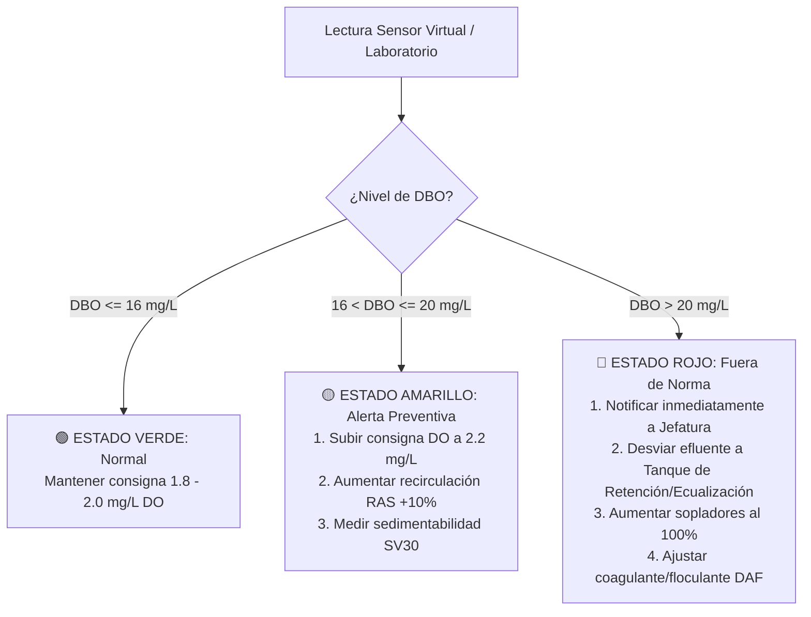

# PROCEDIMIENTO OPERATIVO ESTÁNDAR (POE)
## CONTROL DE AIREACIÓN, OXÍGENO DISUELTO Y CUMPLIMIENTO DE EFLUENTES EN PTAR

| **CÓDIGO:** POE-OP-PTAR-001 | **VERSIÓN:** 2.0 | **FECHA DE EMISIÓN:** 2026-09-11 |
|---|---|---|
| **ÁREA:** Operaciones & Utilidades | **PROCESO:** Tratamiento de Aguas Residuales | **PÁGINA:** 1 de 3 |
| **ELABORADO POR:** Ing. Angelo Apolo *Ingeniero de Procesos / Jefe de Operaciones* | **REVISADO POR:** Superintendencia de Planta | **APROBADO POR:** Gerencia de Operaciones & HSE |

---

### 1. OBJETIVO Y ALCANCE
* **Objetivo:** Estandarizar la operación y control del reactor biológico de lodos activados y sedimentadores secundarios, garantizando un **$100\%$ de cumplimiento ambiental** (descarga final de $\text{DBO} \le 20\text{ mg/L}$ según normativa ambiental TULSMA) y maximizando la **eficiencia energética** de los sopladores mediante consignas dinámicas de oxígeno disuelto.
* **Alcance:** Aplica a todos los operadores de turno, supervisores de planta y técnicos de mantenimiento de utilidades de la Planta de Tratamiento de Aguas Residuales (PTAR).

---

### 2. MATRIZ DE CONSIGNAS OPERATIVAS (SETPOINTS LOOKUP TABLE)
El operador de turno debe verificar cada **2 horas** el caudal de entrada en el SCADA y ajustar las consignas en el panel de control de sopladores según la siguiente matriz:

| Nivel de Carga | Caudal Entrada ($Q_{in}$) | DBO Estimada Entrada | Consigna DO Tanque Biológico | Inyección de Aire Estimada | Consigna VFD Sopladores | Caudal Purga ($WAS$) | Caudal Recirculación ($RAS$) |
|:---:|:---:|:---:|:---:|:---:|:---:|:---:|:---:|
| **Baja (Valle Nocturno)** | $< 700\text{ m}^3\text{/h}$ | $< 280\text{ mg/L}$ | **$1.8\text{ mg/L}$** | $4.5 - 5.5\text{ km}^3\text{/h}$ | $38 - 42\text{ Hz}$ | $8 - 10\text{ m}^3\text{/h}$ | $450 - 500\text{ m}^3\text{/h}$ |
| **Media (Régimen Normal)**| $700 - 800\text{ m}^3\text{/h}$ | $280 - 330\text{ mg/L}$ | **$2.0\text{ mg/L}$** | $5.8 - 6.8\text{ km}^3\text{/h}$ | $44 - 48\text{ Hz}$ | $11 - 13\text{ m}^3\text{/h}$ | $500 - 550\text{ m}^3\text{/h}$ |
| **Alta (Pico Diurno)** | $> 800\text{ m}^3\text{/h}$ | $> 330\text{ mg/L}$ | **$2.2\text{ mg/L}$** | $7.2 - 8.5\text{ km}^3\text{/h}$ | $52 - 58\text{ Hz}$ | $14 - 16\text{ m}^3\text{/h}$ | $550 - 650\text{ m}^3\text{/h}$ |

> [!IMPORTANT]
> **REGLA DE ORO DE PLANTA:**  
> Bajo ninguna circunstancia se debe permitir que el Oxígeno Disuelto supere los **$2.5\text{ mg/L}$** de manera sostenida. Operar por encima de $2.5\text{ mg/L}$ **no mejora la degradación biológica** y genera un sobrecosto eléctrico superior al $30\%$ en los compresores/sopladores.

---

### 3. RUTINA OPERATIVA POR TURNOS DE TRABAJO

#### A. Turno Mañana (06:00 - 14:00) | *Fase de Pico de Carga*
1. **06:00:** Revisar telemetría de sopladores. A esta hora ingresa el primer pico de carga industrial/municipal.
2. Confirmar que el lazo PID module para mantener el $DO$ en $2.2\text{ mg/L}$.
3. Medir en campo la altura del manto de lodos en el clarificador secundario. Si supera **$1.6\text{ m}$**, incrementar purga ($WAS$) en $+2\text{ m}^3\text{/h}$ para evitar arrastre de sólidos en vertedero.

#### B. Turno Tarde (14:00 - 22:00) | *Fase de Estabilización y Segundo Pico*
1. Monitorear el vertedero de salida del clarificador (`Clarifier_Overflow_TSS_mgL`). Debe mantenerse $< 25\text{ mg/L}$.
2. A las **18:00** se presenta el segundo pico diurno: asegurar que los difusores no presenten contrapresión anormal ($< 0.55\text{ bar}$).
3. Verificar predicción del **Sensor Virtual en SCADA / Dashboard**. Si la DBO estimada supera $17\text{ mg/L}$, activar protocolo de alerta preventiva.

#### C. Turno Noche (22:00 - 06:00) | *Fase de Eficiencia Energética (Valle)*
1. La carga orgánica cae por debajo de $280\text{ mg/L}$.
2. Disminuir la consigna de aireación en el PLC hacia **$1.8\text{ mg/L}$**.
3. Verificar que los sopladores desciendan a frecuencia de ahorro ($38 - 42\text{ Hz}$). Esta acción genera el **$70\%$ del ahorro energético del proyecto**.

---

### 4. PROTOCOLO DE RESPUESTA ANTE DESVÍOS (MATRIZ SEMÁFORO)

---

### 5. INDICADORES CLAVE DE DESEMPEÑO (KPIS DE TURNO)
Al finalizar cada turno de 8 horas, el operador debe asentar en la bitácora:
1. **Oxígeno Disuelto Promedio:** Meta: $1.9 - 2.1\text{ mg/L}$.
2. **Consumo Específico de Energía:** Meta: $< 1.15\text{ kWh / kg DBO removida}$.
3. **DBO Efluente Máxima del Turno:** Meta estricta: $< 18.0\text{ mg/L}$ (100% cumplimiento legal TULSMA).
4. **Altura Máxima de Manto de Lodos:** Meta: $< 1.5\text{ m}$.

---
*Fin del Procedimiento Operativo Estándar POE-OP-PTAR-001*
